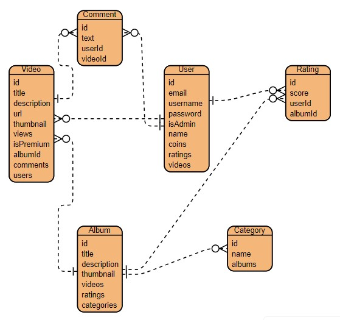

# KBLMovie.
Tugas Besar 2 IF3110 Web Based Development
 

## Table of Contents
* [General Info](#general-information)
* [Skema Basis Data](#skema-basis-data)
* [Endpoint API](#endpoint-api)
* [Pembagian Tugas](#pembagian-tugas)
* [Credits](#credits)

## General Information
Aplikasi yang kami buat adalah web yang bisa digunakan untuk menonton video. Video ini dapat disimpan pada suatu album, yang dapat dicari secara manual pada daftar album yang tertampil maupun melalui search bar. Untuk menunjang aplikasi, dibuat berbagai fitur yang mendukung aplikasi. Fitur-fitur yang secara umum menggunakan REST (Representational State Transfer) sebagai web service yang utama, yaitu fitur login dan register, fitur search album, fitur pemberian rating pada album, fitur pemberian komen pada video, dan fitur untuk melakukan CRUD album, fitur untuk membeli video, dan fitur untuk melakukan CRUD video.

## Skema Basis Data
* Schema
> 

## Endpoint API
Album
* GET /album albumController.index()
* GET /album/search albumController.search()
* GET /album/recommend albumController.recommend()
* GET /album/:id albumController.show()
* POST /album albumController.store()
* PUT /album/:id albumController.update()
* DELETE /album/:id albumController.destroy()

Category
* GET /category categoryController.index()
* GET /category/search categoryController.getAlbums()
* GET /category/:id categoryController.show()

Comment
* GET /comment commentController.index()
* POST /comment commentController.store()
* PUT /comment/:id commentController.update()
* PATCH /comment/:id commentController.patch()
* DELETE /comment/:id commentController.destroy()

Favorite
* GET /favorite/verify favoriteController.verify()
* GET /favorite favoriteController.index()
* POST /favorite favoriteController.store()
* DELETE /favorite favoriteController.destroy()
* DELETE /favorite/:id favoriteController.deleteFavoritesByAlbumId()

Rating
* GET /rating ratingController.index()
* POST /rating ratingController.modify()
* DELETE /rating ratingController.destroy()

Subscription
* POST /subscribe subscriptionController.request()
* DELETE /subscribe subscriptionController.unsubscribe()
* GET /subscribe subscriptionController.verify()
* DELETE /subscribe/:id subscriptionController.deleteSubscriptionByAlbumId()

Token
* POST /token/check tokenController.checkToken()
* POST /token/addCoins tokenController.addCoins()

User
* GET /user userController.index()
* GET /user/check userController.check()
* GET /user/admin userController.admin()
* GET /user/emails userController.getEmailsByIds()
* GET /user/me userController.me()
* GET /user/:id userController.show()
* POST /user/token userController.token()
* POST /login userController.token()
* POST /register userController.store()
* POST /user/buy/:id userController.buyVideo()

Video
* GET /video/:id videoController.show()
* POST /video videoController.store()
* PUT /video/:id videoController.update()
* DELETE /video/:id videoController.destroy()

## Pembagian Tugas
* Fitur Redeem Token : 13521064
* Fitur Search Album : 13521064, 13521108
* Fitur Login/Register : 13521049, 13521108 
* Fitur Pemberian Rating : 13521049
* Fitur Video : 13521049
* Fitur Comment : 13521049
* Fitur Subscribe : 13521108
* Fitur Favorite : 13521049
* Fitur Category : 13521108
* Fitur Album : 13521049
* Fitur SoapCaller : 13521108
* DB Core : 13521108, 13521049
* Docker : 13521108
* Caching : 13521108

## Credits
This project is implemented by:
1. Brian Kheng (13521049)
2. Bill Clinton (13521064)
3. Michael Leon Putra Widhi (13521108)
